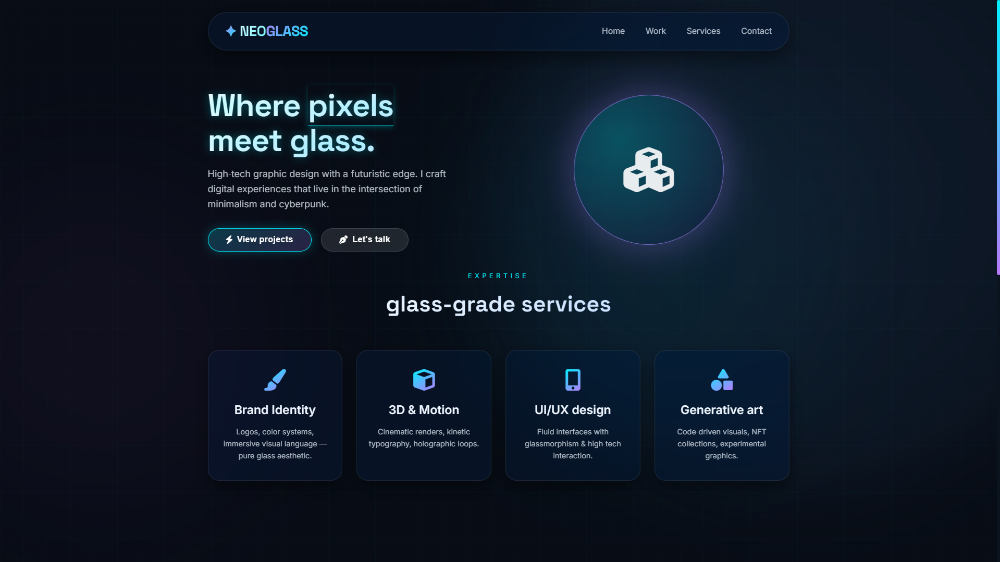

# ✦ NeoGlass — High-Tech Graphic Designer Portfolio

**NeoGlass** is a futuristic, cyberpunk-inspired portfolio website for a graphic designer specializing in glassmorphism, digital art, and high-tech visual experiences. Built with pure HTML, CSS, and vanilla JavaScript — no frameworks, no dependencies. Every element is crafted to reflect the "glass core" aesthetic with blurred backgrounds, neon accents, and smooth interactions.

## ✨ Features

### 🎯 Core Aesthetic
- **Glassmorphism Design** — Backdrop blur, transparent cards, frosted glass effect
- **Cyberpunk Color Palette** — Cyan (#00f0ff) and Purple (#b77aff) neon accents
- **Dark Futuristic UI** — Deep blue-black backgrounds with glowing elements
- **Custom Animations** — Floating blobs, pulse glow, 3D orb rotation
- **Scroll Reveal** — Intersection Observer-based fade-up animations
- **Responsive Design** — Mobile, tablet, and desktop optimized

### 🖌️ Visual Elements
- **Animated Background** — 3 floating blur blobs with smooth movement
- **Tech Grid Overlay** — Subtle 50px grid for high-tech feel
- **Glass Orb** — 3D interactive sphere that follows mouse movement
- **Neon Buttons** — Gradient borders with glow effects
- **Custom Scrollbar** — Branded cyan-purple gradient scrollbar
- **Hover Effects** — Cards lift and glow with cyan borders

### 📱 Interactive Features
- **Mouse-driven 3D Orb** — Rotates based on cursor position
- **Intersection Observer** — Smooth fade-up animations when scrolling
- **Interactive Cards** — Portfolio and service cards with hover states
- **Glass Form** — Cyberpunk-style contact inputs with focus effects
- **Playful Alerts** — "Transmit" button with cosmic feedback

## 🛠 Technologies Used

- **HTML5** — Semantic structure
- **CSS3** — Custom properties, Flexbox, Grid, Keyframes, Backdrop-filter
- **JavaScript (ES6+)** — Intersection Observer, Mouse events, DOM manipulation
- **Font Awesome 6** — 100+ icons for services and portfolio
- **Google Fonts** — Inter (clean) + Space Grotesk (high-tech display)
